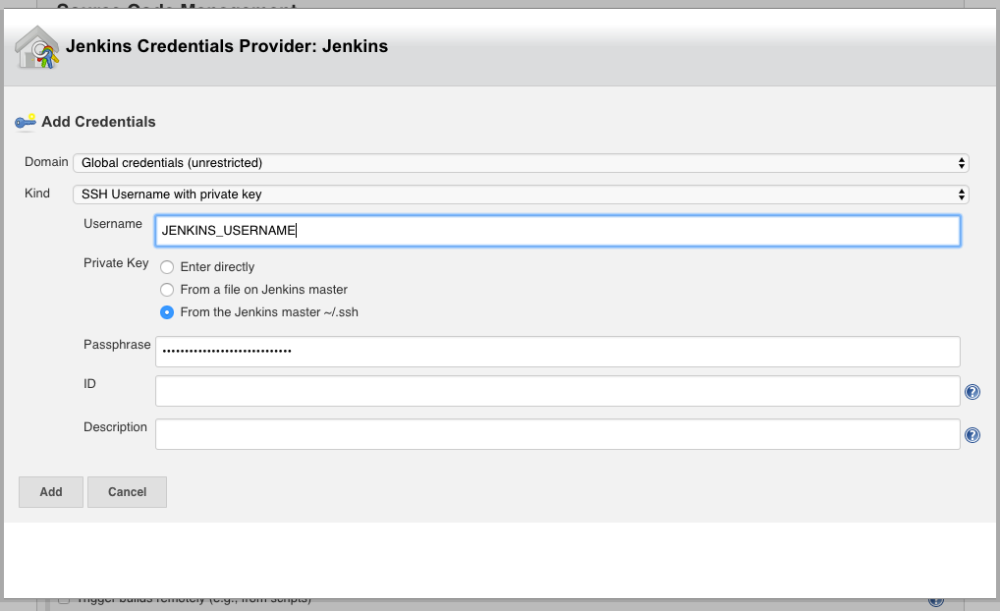

Jenkins Vault Quota Checker Job
=====================

This role creates a job in Jenkins which automatically runs the Vault Quota Checker script. 
The python script was developed for Python 2.7.11

### Dependencies
- [Jenkins "Envinject Script Plugin"](https://wiki.jenkins-ci.org/display/JENKINS/EnvInject+Plugin)
- [This commit adds the environment script plugin to ansible-private-roles](https://github.sig.oregonstate.edu/ecs-data/ansible-private-roles/commit/97f0f554779af8d18eb975bfe9f937754f0ac3c0)

### Usage
---------

1. Add Github enterprise SSH credentials.
2. Add your [configuration file](VaultQuotaChecker/configuration.example.json) as a secret file binding. This will be passed to the python script via the $CONFIGJSON variable.

### Notes
-----------
The fields in configuration.json get formatted into this url template.
'{hostname}/{version}/organizations/{org}/environments/{env_name}/keyvaluemaps/{map_name}/entries/{entry_name}'

The output of getKVMQuotaCount() makes it into the Jenkin's email via [shell expansion on the script.](templates/jobs/config.j2#L41)

### Outcome
-----------
An email is sent on success and failure to the project recipient list.

